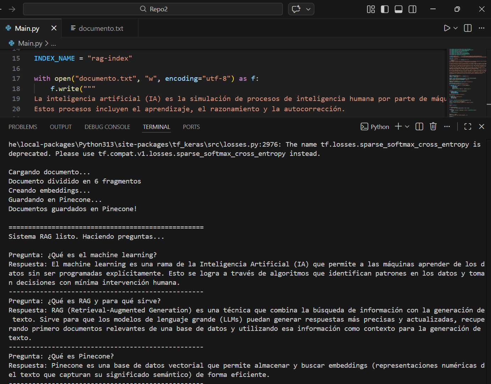

# Sistema RAG — Retrieval-Augmented Generation

Este proyecto construye un pipeline de pregunta-respuesta basado en RAG. La idea principal es que el modelo no responde de memoria, sino que primero busca información relevante en una base de datos de vectores y luego usa esa información como contexto para generar una respuesta precisa.

---

## ¿Cómo está construido?

El sistema tiene dos fases:

**Fase 1 — Indexación** (se corre una vez para cargar el documento):
```
documento.txt
    │
    ▼
Se divide en fragmentos pequeños (300 caracteres)
    │
    ▼
Cada fragmento se convierte en un vector numérico (embedding)
    │
    ▼
Los vectores se guardan en Pinecone
```

**Fase 2 — Consulta** (cada vez que el usuario hace una pregunta):
```
Pregunta del usuario
    │
    ▼
Se buscan los 3 fragmentos más similares en Pinecone
    │
    ▼
Se construye un prompt: contexto recuperado + pregunta
    │
    ▼
El LLM genera una respuesta basada en ese contexto
    │
    ▼
Respuesta final
```

### Tecnologías utilizadas

| Herramienta | Función |
|---|---|
| **LangChain** | Orquesta todo el pipeline RAG |
| **HuggingFace** (`all-MiniLM-L6-v2`) | Genera los embeddings del texto (gratuito, corre local) |
| **Pinecone** | Almacena y recupera vectores eficientemente |
| **Groq** (`llama-3.3-70b-versatile`) | Modelo de lenguaje que genera las respuestas |

---

## Antes de empezar

Se necesitan dos API Keys gratuitas:

- **Groq:** crear cuenta en [console.groq.com](https://console.groq.com) y generar una key
- **Pinecone:** crear cuenta en [pinecone.io](https://pinecone.io), generar una key y crear un index llamado `rag-index` con dimensión `384` y métrica `cosine`

---

## Pasos para ejecutar


**1. Instalar dependencias:**
```bash
pip install langchain langchain-community langchain-groq langchain-pinecone langchain-huggingface langchain-text-splitters pinecone-client sentence-transformers tf-keras
```

**2. Agregar las API Keys en `Main.py`:**
```python
os.environ["GROQ_API_KEY"]     = "Se quita el API GROQ porque el git no permite subirlo"
os.environ["PINECONE_API_KEY"] = "Se quita el API PINECONE porque el git no permite subirlo"
```

**3. Correr el script:**
```bash
python Main.py
```

---

## Resultado esperado

```
Cargando documento...
Documento dividido en 6 fragmentos
Creando embeddings...
Guardando en Pinecone...
Documentos guardados en Pinecone!

==================================================
Sistema RAG listo. Haciendo preguntas...

Pregunta: ¿Qué es el machine learning?
Respuesta: El machine learning es una rama de la IA que permite a las
máquinas aprender de los datos sin ser programadas explícitamente...
--------------------------------------------------
Pregunta: ¿Qué es RAG y para qué sirve?
Respuesta: RAG es una técnica que combina búsqueda de información con
generación de texto para producir respuestas más precisas...
--------------------------------------------------
Pregunta: ¿Qué es Pinecone?
Respuesta: Pinecone es una base de datos vectorial diseñada para almacenar
y buscar embeddings de manera eficiente...
--------------------------------------------------
```

---

## Capturas de pantalla



---

## Archivos del proyecto

```
Repo2/
├── Main.py           # Código principal del pipeline
├── documento.txt     # Texto fuente que el RAG indexa y consulta
├── Images/           # Evidencia de ejecución
└── README.md         # Documentación
```
